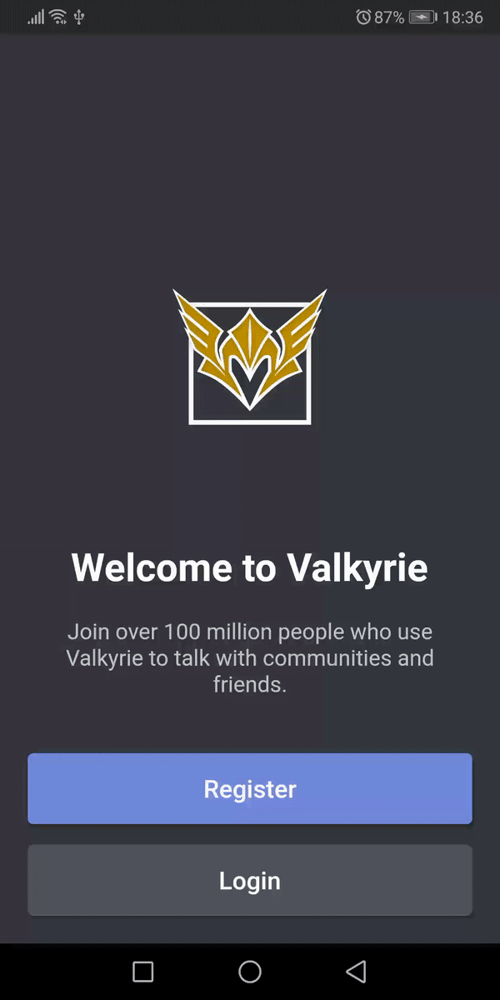
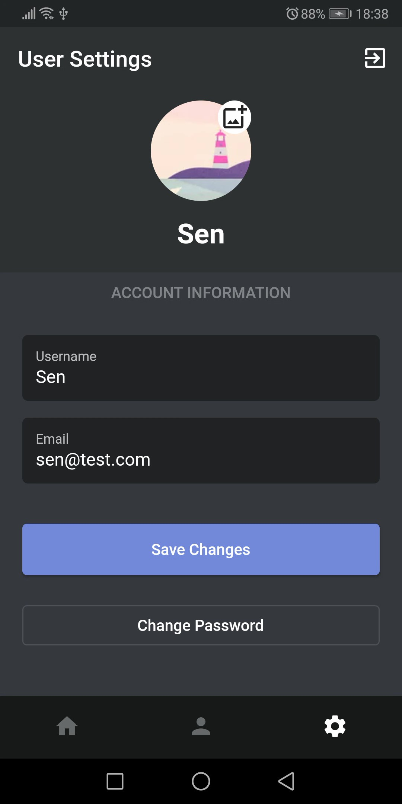
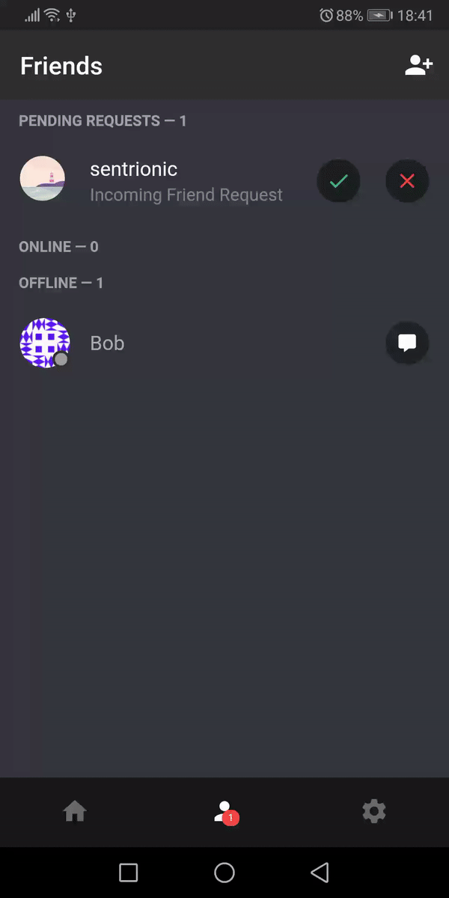
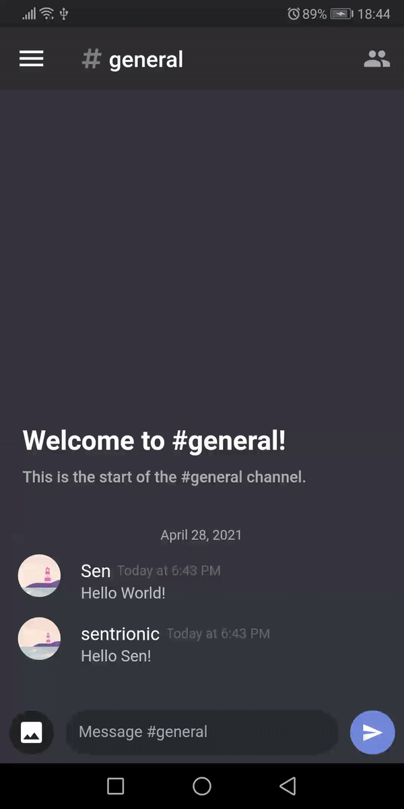
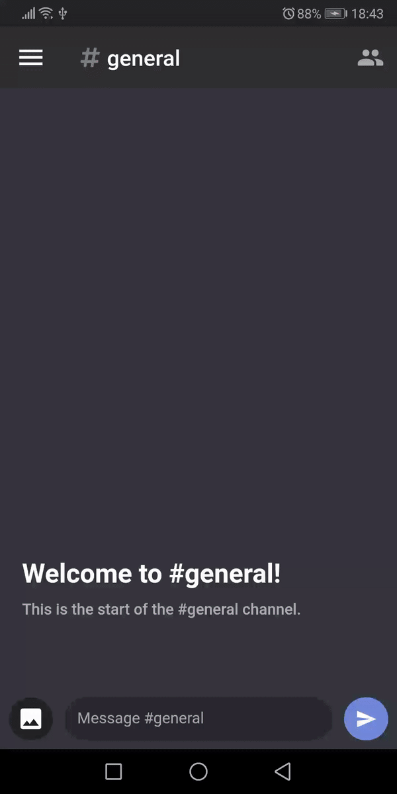
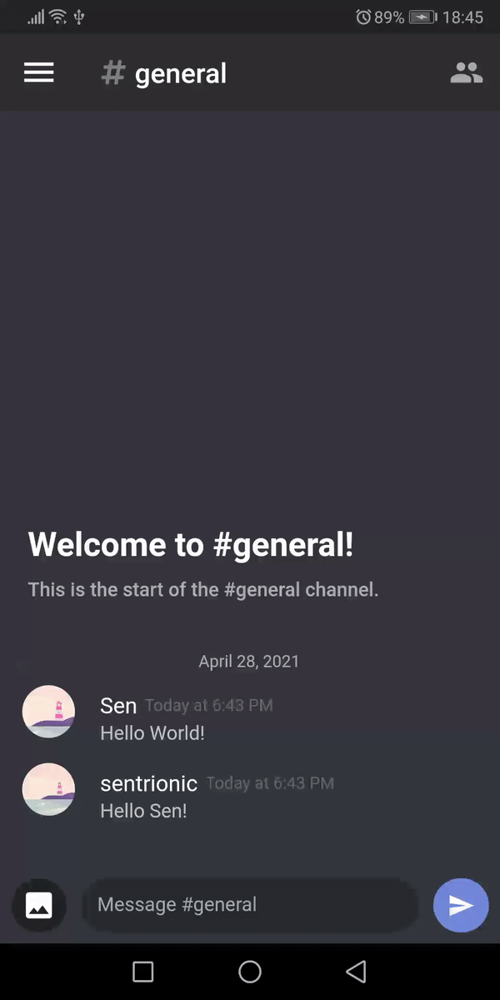
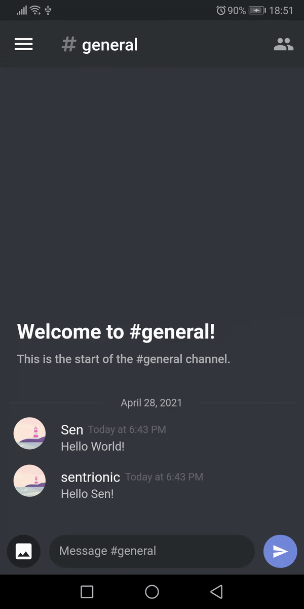

# ValkyrieApp

The mobile application for [Valkyrie](https://github.com/sentrionic/Valkyrie) written in Flutter.

## Screenshots

<table><tr>
  <tr>
    <td></td>
    <td></td>
    <td></td>
    <td></td>
    </tr>
    <tr>
    <td></td>
    <td></td>
    <td></td>
    <td></td>
  </tr>
  </table>

## Stack

- Flutter

- [Bloc and Cubit](https://bloclibrary.dev/#/) for state management

- [get_it](https://pub.dev/packages/get_it) for dependency injection

- REST for data fetching and websockets for real time events

For all features check out the parent [repository](https://github.com/sentrionic/Valkyrie).
For the socket.io version check out the `main` branch.

The architecture of this app is based on Reso Coder's [Domain Driven Design Principles](https://resocoder.com/2020/03/09/flutter-firebase-ddd-course-1-domain-driven-design-principles/):

> **Application** contains all the Use Cases

> **Domain** contains the business logic (entities and validation)

> **Infrastructure** contains the repositories and network calls

> **Presentation** contains all the UI components and the web sockets

## Installation

You will need Flutter Version 2 to run this app.

This app was created and tested on `Flutter 2.5.1` and `Dart 2.14.2` .

```
git clone https://github.com/sentrionic/ValkyrieApp.git
cd ValkyrieApp
flutter packages get
```

For debug mode run `flutter run` and for production mode run `flutter run --release`

If you want to use your own server you will base to change the `BaseUrl` in `InjectableModule`
and then run `flutter pub run build_runner build --delete-conflicting-outputs`

If said server runs on `localhost` you will also need to add `android:usesCleartextTraffic="true"` to the Android manifest.

## Tests

To run all tests run `flutter test`

## Additional Information

This app was tested and is working on Android and the general design is based on Discord's Android version.

The iOS version will need additional configuration done to the packages to run.
As I do not own a Mac I cannot work on it.
